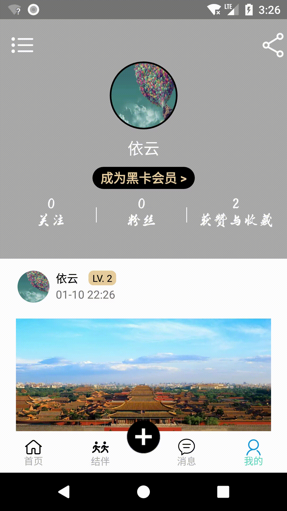

# Traveling
#### 大创项目——基于推荐系统的游记攻略一站式旅游社交平台  

*正在重构项目*，并已将部分成果上传至[new_version](https://github.com/12313kaihuang/Traveling/tree/new_version)分支
##### 项目简介：      
*全国大学生创新创业大赛参赛项目*，被预评为**国家级**项目。       

* **登录模块**：
  采用`SpringBoot` + `Hibernate` 搭建的后台接口，现已实现通过手机-验证码登录、邮箱-密码登录以及手机号-密码登录三种登录方式。      

  其中，*用户名输入框*和*密码输入框*都是**自定义的`EditText`**，当键入东西后会有一个清除图标出现，点击后即可清空输入内容。具体效果见：[MyCustomEditText](https://github.com/12313kaihuang/MyCustomEditText)。
  
* **首页模块**：  
  有搜索功能和三个子模块，其中“搜索”即为以文章标题来相关文章、“最新”模块显示最新发布的一些游记信息，“关注”模块显示所关注的人所发布的游记文章，未登录状态此模块不显示文章，“推荐”模块显示推荐的游记文章，暂未实现，暂时显示的是最新的游记文章。   

  搜索功能除了可以手动输入文字之外，还可以实现**语音输入**。是通过科大讯飞的语音引擎实现的语音转文字功能。  搜索框也是**自定义的控件**，具体效果见[SearchView](https://github.com/12313kaihuang/SearchView)。

  每篇文章都可以点击进去查看详情，可以点赞和评论，点击用户头像后还可以挑战到个人主页，可以加关注或者私聊。同时该页面还***仿照微博主页实现了沉浸式状态栏布局***，当滑动屏幕时顶部的`statusBar`颜色会发生改变，同时`ActionBar`也会逐渐显示出来。具体效果可在下面的演示图中查看。  

  游记列表的显示是通过`RecyclerView`来加载的，响应效果是通过监听`ScrollView`的滑动同时配合`immersionbar`实现的。  

* **结伴模块**：
  结伴消息的查看，用户可以查看结伴消息进行组队旅游等等，与首页的游记的实现类似。    

* **消息模块**：
  使用`LeanCloud`的即时`IM`框架实现，该模块可显示最近与谁聊了天，点进去后可以进行聊天。通过用户的个人主页点击私聊按钮也可以跳转到私聊页面。    

* **我的模块**：
  显示自己的头像，关注数以及所发布的文章等等，通过当滑动屏幕的时候也会有一个响应式显示`ActionBar`的 功能，具体实现同个人主页中的实现方式。 其次，还有一个侧滑菜单，可以调转到修改资料、密码等功能，可以进行登录/退出登录等操作。  

  修改密码界面密码输入框是**自定义的`EditText**`，会有一个显示/隐藏的按钮出现，点击可以显示/隐藏密码。具体效果见：[MyCustomEditText](https://github.com/12313kaihuang/MyCustomEditText)。
  
* **发布游记/结伴信息**：
点击中间的“+”号，可以选择发布游记、攻略还是结伴，然后跳转到对应的发布页面，游记与攻略的发布暂时只能选择一张图片。具体请看下面的项目演示。    

封装了一些常用的[util](/app/src/main/java/com/android/traveling/util)工具包 。    

##### 项目时间：      
2018年10月 ~ 2019年4月      

##### 项目成员：  

|  姓名  |    职责    |                             分工                             |
| :----: | :--------: | :----------------------------------------------------------: |
|  胡钰  | 项目负责人 | 整个项目的设计、后台接口的实现、数据库设计以及`App`“首页”、“聊天”和“我的"模块的设计 |
| 刘嘉铭 |    组员    |                 前期聊天界面的实现，测试等。                 |
|  李婷  |    组员    |                        结伴模块的实现                        |
| 李志明 |    组员    |             查找界面资源，添加测试数据，测试等。             |

##### 项目部分功能展示：  
  

  

  

  

**所使用的到的控件/技术**：    

| 控件/技术 | 用途 |
|:---:|:---:|
|`ViewPager`|实现主页三个小模块的切换|
|`RecyclerView`|各种列表的显示，采用了自定义`Adapter`|
|`DrawerLayout`|实现侧滑菜单功能|
|`BroadCastReceiver`|当登录/退出登录时通知相关`Activity`/`Fragment`修改相关`UI`界面|
|`Dialog`|自定义`Dialog`提示框|
|`TabLayout`|实现与ViewPager配合的滚动条|

**所使用的到的框架**：   

| 框架| 用途|
|:---:|:---:|
|[CircleImageView](https://github.com/hdodenhof/CircleImageView)|实现圆形头像的展示|
|[SmartRefreshLayout](https://github.com/scwang90/SmartRefreshLayout)|实习下拉刷新，上拉记载的UI动画|
|[Litepal](https://github.com/LitePalFramework/LitePal)|存取当前已登录的用户信息等|
|[retrofit](https://github.com/square/retrofit)|网络请求|
|[PhotoView](https://github.com/chrisbanes/PhotoView)|实现图片的展示以及放大缩小功能|
|[picasso](https://github.com/square/picasso)|加载文章图片，用户头像等|
|[gson](https://github.com/google/gson)|解析网络请求获取的json数据|
|[goodView](https://github.com/venshine/GoodView)|实现点赞动画|
|[immersionbar](https://github.com/gyf-dev/ImmersionBar)|实现沉浸式状态栏|

**所使用的第三方SDK**：   

| SDK| 用途|
|:---:|:---:|
|LeanCloud IM即时通讯|实现聊天功能|
|腾讯 Bugly|实现崩溃日志管理|
|科大讯飞语音引擎|实现语言转文字功能|

